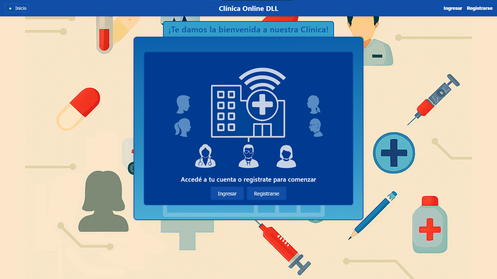
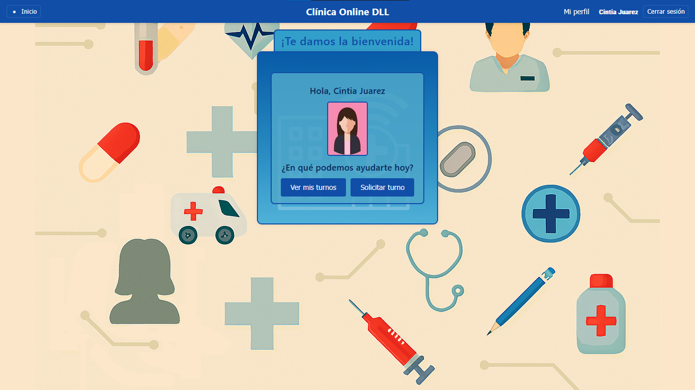
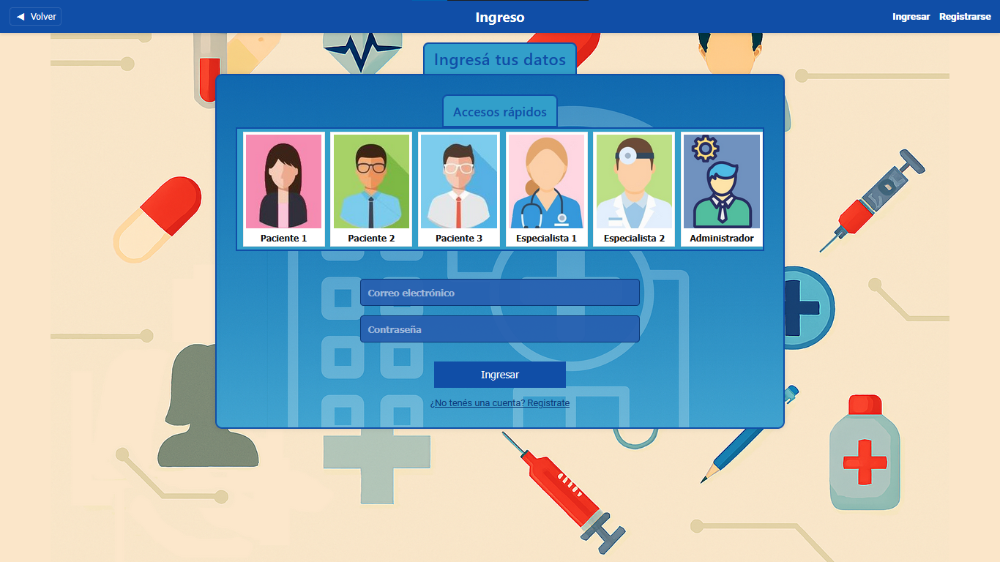
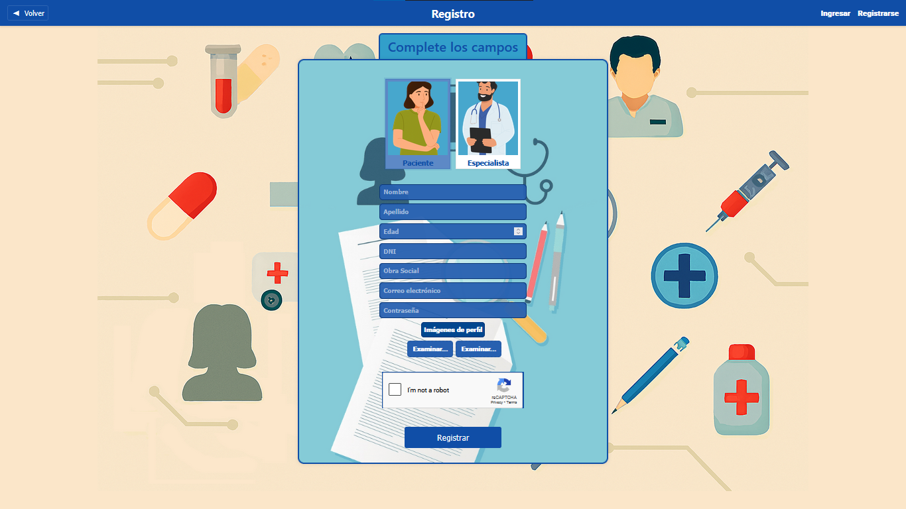
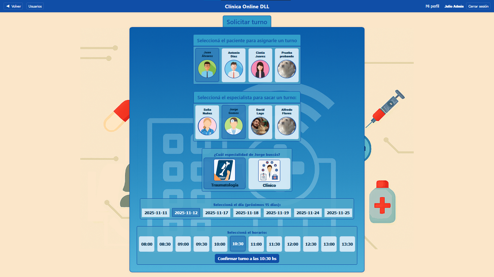

# Clinica Online DLL
Este proyecto fue desarrollado con Angular CLI, versión 20.3.1
Se trata de un proyecto final para la materia: Laboratorio de Computación IV
El mismo consta de un sistema de clínica online el cual permite manejar turnos asociados a pacientes y especialistas. Los administradores también pueden administrarlos.

## Servidor de desarrollo
Para arrancar el servidor de desarrollo local, utilizar el siguiente comando:
```bash
ng serve
```
Una vez que el server esté corriendo, abrí tu navegador y dirigite a `http://localhost:4200/`. La aplicación se recargará automáticamente cuando modifiques alguno de los archivos de recursos.

## Algunas Imágenes del proyecto

### Página de bienvenida


### Página de home usuarios


### Página de login


### Página de registro


### Página de solicitar turno

